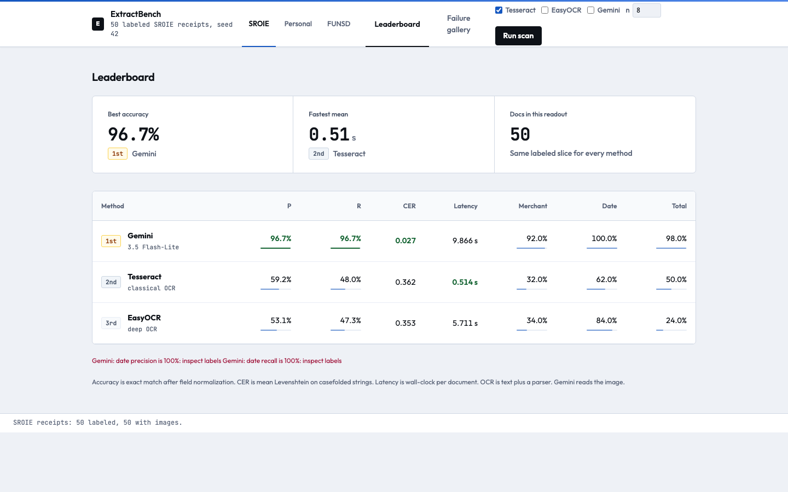
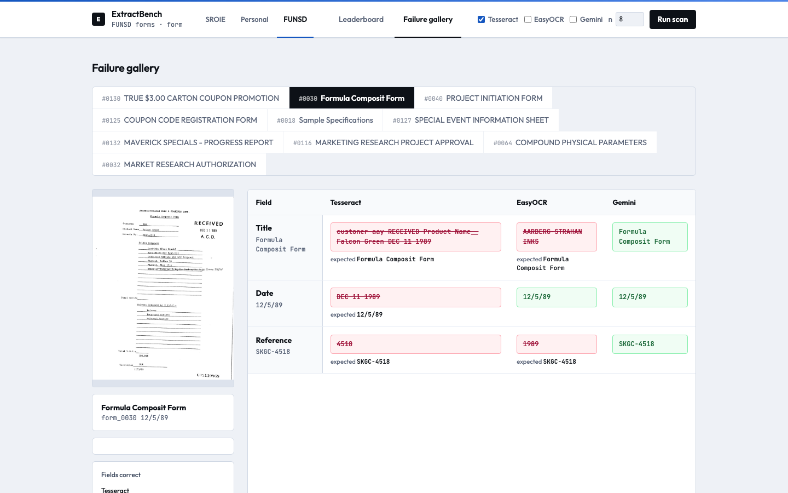
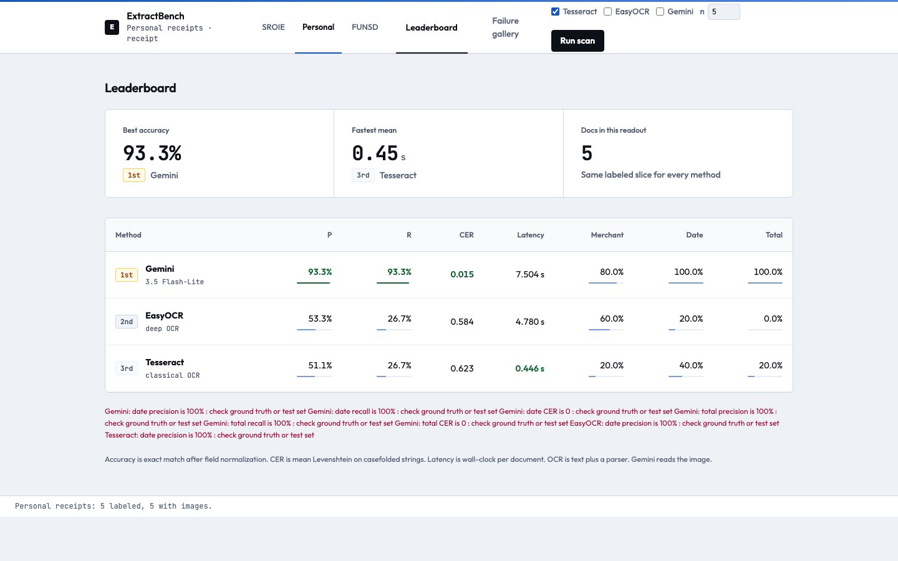

# ExtractBench

Compare **Tesseract**, **EasyOCR**, and a **Gemini** vision-language model on the same hand-labeled documents. The referee is ground truth verified from the image — never a pipeline output, and never an unverified dataset JSON dump.

Receipt fields: **merchant**, **date**, **total**. Primary set: [ICDAR 2019 SROIE](https://huggingface.co/datasets/jsdnrs/ICDAR2019-SROIE) (CC-BY-4.0), frozen 50-id train slice in `data/manifest.json` (seed 42).

This is its own data point. Septiawan et al. (2025) compared GPT-4o to EasyOCR+LLaMA. Default here is Gemini plus a deterministic OCR parser, not that setup. GPT-4o and Claude stay unimplemented: neither API has an ongoing free tier.

## Latest numbers (50 verified receipts)

Gemini **3.5 Flash-Lite** (image → JSON) vs Tesseract/EasyOCR + the same regex parser.

| Pipeline | Macro P | Macro R | Macro CER | Latency mean (s) |
| --- | ---: | ---: | ---: | ---: |
| tesseract | 59.2% | 48.0% | 0.362 | 0.514 |
| easyocr | 53.1% | 47.3% | 0.353 | 5.711 |
| vlm-gemini | 96.7% | 96.7% | 0.027 | 9.866 |

Gemini wins every accuracy axis. EasyOCR is the best **date** OCR engine (84% recall vs Tesseract 62%) but the worst **total** picker (24%). Tesseract is faster (0.5s vs 5.7s vs 9.9s). Gemini list price for this run is **$0.0226**; billed was $0 on the free tier. Full cost columns live in [results/leaderboard.md](results/leaderboard.md).

Gemini **date** is 50/50 — the code flagged that 100% as a cue to inspect labels, not a trophy. Dates on these receipts are unambiguous printed fields, so a strong VLM can actually clear them. Merchant is 46/50: the four misses are brand name vs legal entity (IKEA vs IKANO HANDEL, myNEWS.com vs MYNEWS RETAIL SB, SUSHI MENTAI vs MIZU MENTAI, BHPetrol vs ESJAY FUEL). One total miss is 20.80 vs 20.90 (rounding).

Side-by-side misses: [results/failure_gallery.md](results/failure_gallery.md).

One SROIE draft was wrong on the image and was corrected: `train_0414` merchant `UHAT` → `UBAT`.

## Other datasets

Two more sets share the same engines and scoring. Their leaderboards never mix into the locked SROIE table.

**Personal receipts** — same merchant / date / total fields. Upload your own images, or seed a second receipt board that never overlaps the locked 50:

```bash
uv run python scripts/download_personal.py --n 5   # seed 42, ids 51–55
uv run python scripts/label.py --dataset personal
uv run python scripts/run_benchmark.py --dataset personal --pipelines tesseract,easyocr,vlm
```

Five extra SROIE images are labeled from the picture and live in `data/personal/`. Unlabeled uploads still extract only. Latest 5-doc readout ([results/personal_leaderboard.md](results/personal_leaderboard.md)): Gemini **93.3%** P/R, Tesseract/EasyOCR **26.7%** recall.

**FUNSD forms** — `title`, `date`, `reference`. Frozen 10-id slice ([nielsr/funsd-layoutlmv3](https://huggingface.co/datasets/nielsr/funsd-layoutlmv3), seed 42), labels written from the images.

| Pipeline | Macro P | Macro R | Macro CER | Latency mean (s) |
| --- | ---: | ---: | ---: | ---: |
| tesseract | 0.0% | 0.0% | 0.955 | 0.347 |
| easyocr | 11.1% | 3.7% | 0.776 | 3.509 |
| vlm-gemini | 85.2% | 80.5% | 0.325 | 8.595 |

The receipt parser does not transfer. Gemini still leads, mostly by reading titles and dates; reference numbers are where it drops (Bates stamps vs form ids). Full table: [results/funsd_leaderboard.md](results/funsd_leaderboard.md).

```bash
uv run python scripts/download_funsd.py --n 10
uv run python scripts/run_benchmark.py --dataset funsd --pipelines tesseract,easyocr,vlm --n 10
```

## Web bench

A printed table is the score. The UI is how you check that the score is about the documents, not the spreadsheet.

```bash
uv run python scripts/serve.py
```

Open http://127.0.0.1:8765.

The bench lets you switch SROIE / personal / forms, pick pipelines, and watch a scan fill the leaderboard and failure gallery as each document finishes. Clicking a miss shows the image next to every engine’s prediction and the hand label — that is the only way to see brand-vs-legal-name errors, a 20.80 vs 20.90 total, or a form title the receipt parser never finds. Personal receipts are labeled in the same view, so the referee stays tied to the image instead of a JSON file you never opened.







Gemini is skipped unless `GEMINI_API_KEY` is set in `.env`.

## Setup

```bash
brew install tesseract          # classical OCR binary
uv sync --group dev             # Python 3.12 env
cp .env.example .env            # then put GEMINI_API_KEY in .env
```

## Data and labeling

```bash
uv run python scripts/download_sroie.py --n 50
uv run python scripts/label.py                   # opens each image; accept/edit/skip
```

SROIE `company` / `date` / `total` are copied as a **draft**. `scripts/label.py` will not mark a record verified unless you accept or edit it. Scoring refuses unverified files.

After you have looked at an image you can write a label non-interactively:

```bash
uv run python scripts/label.py --write-verified train_0042 --from-draft --notes "matches image"
uv run python scripts/label.py --write-verified train_0042 \
    --merchant "FOO SDN BHD" --date 25/12/2018 --total 9.00
uv run python scripts/label.py --dataset personal --write-verified my-lunch \
    --merchant "CAFE" --date 08/09/2026 --total 12.40
```

## CLI

By-eye Tesseract loop (no aggregate table):

```bash
uv run python scripts/run_benchmark.py --pipelines tesseract --n 15 --eye
```

All three pipelines + comparison table (VLM is skipped if no API key):

```bash
uv run python scripts/run_benchmark.py --pipelines tesseract,easyocr,vlm --n 50
```

Writes `data/runs/` (gitignored) and copies the table to `results/`. Pass `--dataset personal` or `--dataset funsd` for the other boards.

## What the numbers mean

| Number | Meaning |
| --- | --- |
| Field precision / recall | Exact match after normalization (date → calendar date, total → cents, merchant / title / reference → casefold + punctuation stripped). Wrong prediction is both an FP and an FN. |
| CER | Mean Levenshtein / max(len(gt), 1) on casefolded, whitespace-squeezed strings. Near-misses that P/R treats as total failures. |
| Latency | Wall-clock seconds per document. Local OCR cost is time, not $0. |
| List cost | Gemini token usage × published paid rates ($0.30/M input, $2.50/M output for 3.5 Flash-Lite), even on the free tier. |
| Billed | Actual API charges (0.00 on free tier). |

A 100% score on any metric prints a warning. Treat that as a cue to inspect labels, not a result.

OCR pipelines share `parse.py` (regex/heuristics), dispatched by document type. The VLM is image → JSON.

## Tests

```bash
uv run pytest
```
